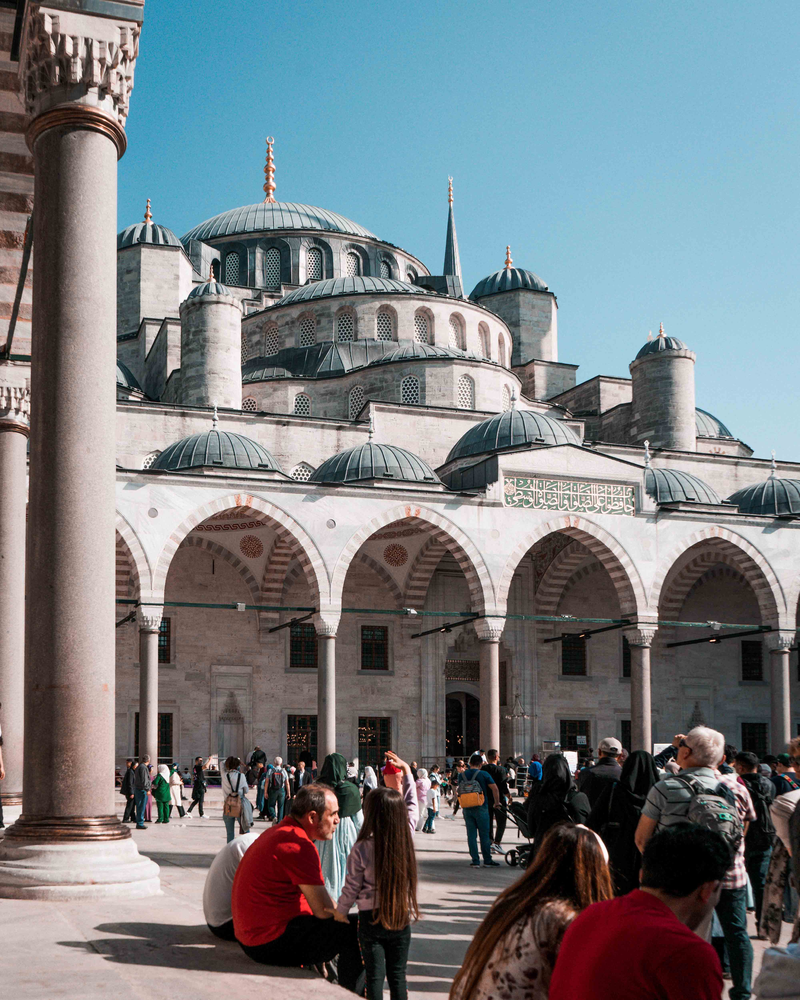
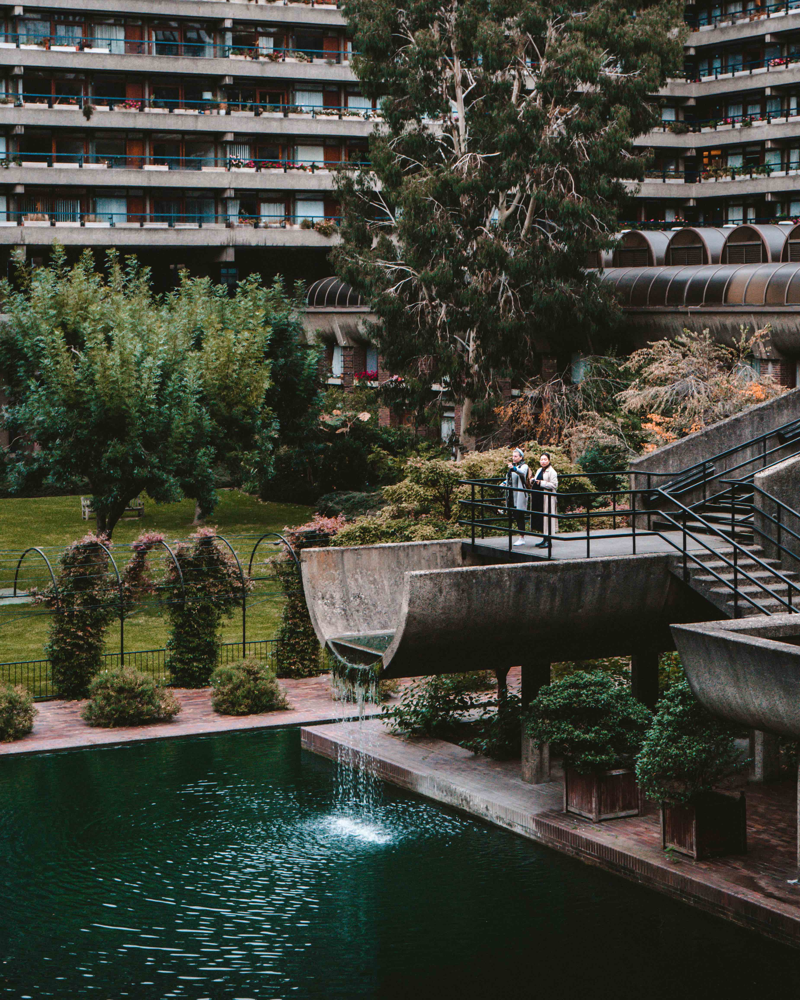

Architecture has drawn me in for a long time and if I hadn't become a physicist maybe I'd be an architect.

Something about architecture, or design, or decision making in general screams that it's a big optimisation problem.

Given your constraints (space, site, time, rules), you are trying to find the best form, materials and structures to house people, facilitate commercial activity or any other particular purpose.

> Form follows function.

_Old town Dubrovnik, Croatia. Limitations such as local materials, technology, availability of builders means that the city has a natural sense of harmony._

Architecture enthusiasts usually engage in 'reading' buildings and interpret the causes of why a building is like what it is.

At the most fundamental level, building elements are meant to house people or their activities. Roofs are meant to protect spaces from the elements, walls are meant to offer protection, and columns and arches are meant to support everything structurally.

The urban planning concept of the 'ideal city' suggests that there may be a 'solution' to the optimisation problem of architecture.

_What is the ideal way to house people? A block of identical flats, with a communal garden in the middle?_

Where this analogy of optimisation falls down, is when the concept of beauty arises. A building being designed to function can be appreciated to be useful, but decoration, symmetry and colour is what makes it beautiful.

_A building for housing people (royals), also with a garden in the middle._

_More to continue..._
